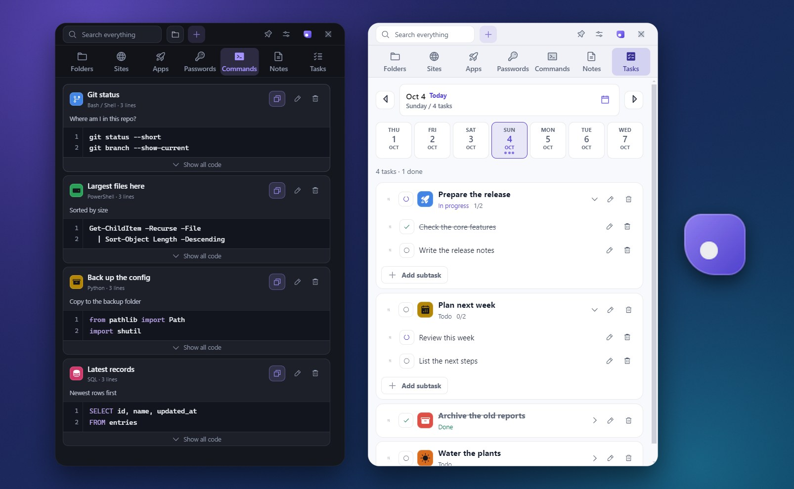
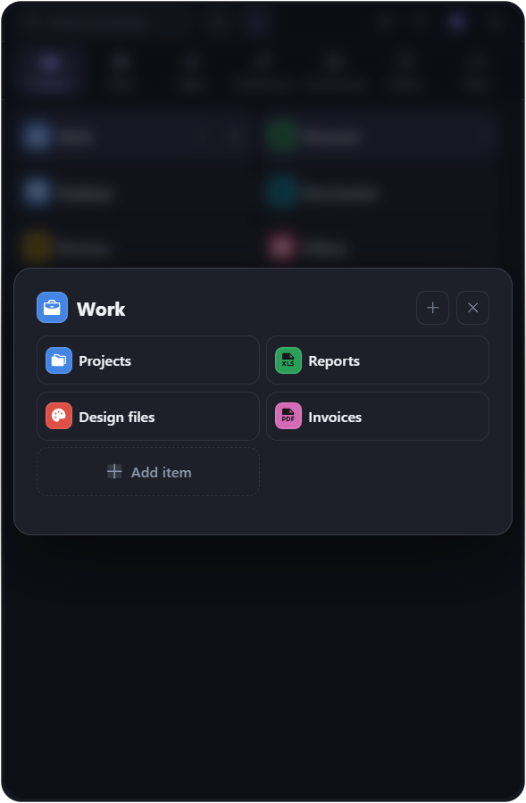
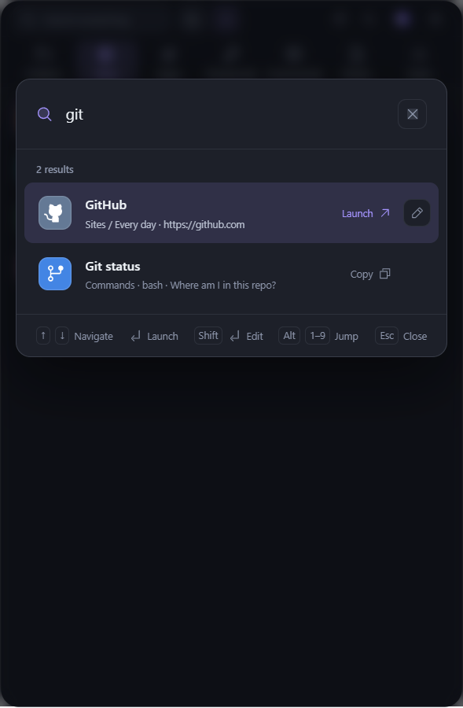
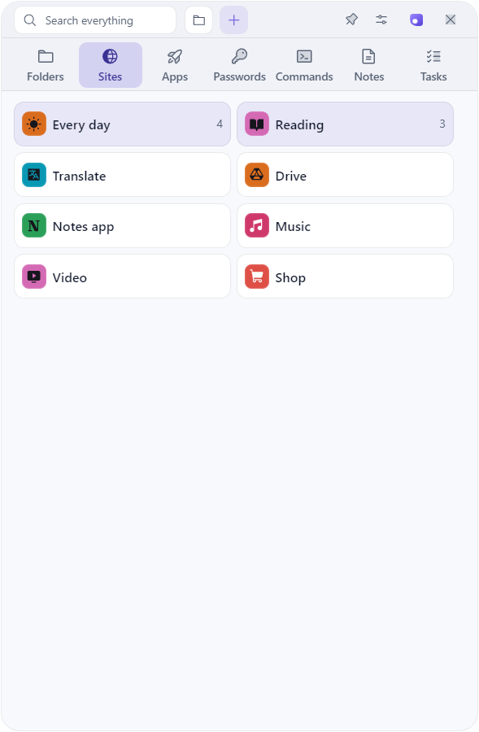
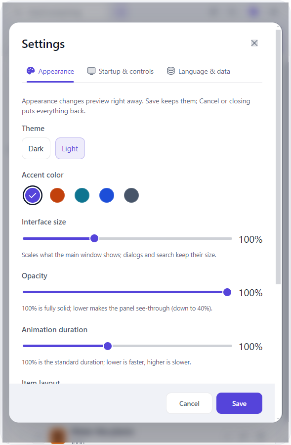

# Marubako

[English](README.md) | [简体中文](README.zh-CN.md)

[](https://github.com/KaidoAsuka/marubako/actions/workflows/ci.yml)
[](LICENSE)

Marubako is a small launcher panel for Windows: your folders, websites, apps, notes, commands, passwords you want at hand, and daily tasks live in one window. It sits at the edge of your screen as a floating bubble, opens with a global shortcut, and is built to be driven from the keyboard.

<p align="center">
  
</p>

## Features

- **Seven categories in one panel.** Folders, Sites, Apps, Passwords, Commands, Notes and Tasks. Put items in groups, and show them as tiles or as a list.
- **A floating bubble that gets out of the way.** Collapse the panel into a small bubble that stays on top at your screen edge. Click it to peek, double-click to keep the panel open.
- **Keyboard first.** `Ctrl + Alt + Space` brings the panel up from any program. `Ctrl + K` searches everything, `Alt + 1` to `Alt + 7` switch categories, `Ctrl + N` adds an item, `Esc` collapses the panel.
- **Add by pasting or dropping.** Paste a link or a path with `Ctrl + V`, or drop files, folders, shortcuts and web addresses onto the panel. Marubako files them in the right category.
- **Commands you can copy.** Keep scripts in PowerShell, Bash, Batch, Python, JavaScript, TypeScript, SQL, JSON or YAML with syntax highlighting. They are copied, never run.
- **Daily tasks.** A task list per day with subtasks, a week strip and a calendar.
- **Local only.** No account and no cloud. Your data is one plain JSON file on your PC, with automatic daily backups and export and import. The only network traffic is the update check.
- **Yours to style.** Dark and light themes, five accent colors, interface size, opacity and animation speed. The interface comes in English, Chinese and Japanese and follows your system language at first start.

## Screenshots

<table>
  <tr>
    <td></td>
    <td></td>
  </tr>
  <tr>
    <td></td>
    <td></td>
  </tr>
</table>

## Download and install

Requires Windows 10 or 11 (64-bit).

1. Open the [latest release](https://github.com/KaidoAsuka/marubako/releases/latest) and download `Marubako-Setup-<version>.exe` from its **Assets**.
2. Run the installer. Windows will probably stop you with a blue window that says **Windows protected your PC**. This is expected: the installer is not code-signed yet (certificates cost money, and this is a free hobby project), and SmartScreen warns about every new program that is not signed. To go on:
   1. Click **More info**. A second button appears.
   2. Click **Run anyway**.
3. The installer has no wizard and asks nothing: it installs Marubako for your Windows account only (no administrator prompt) into `%LOCALAPPDATA%\Programs\Marubako` and starts it.

If you want to be sure the file is the one published here, download it only from the Releases page of this repository and compare its checksum with the SHA-256 shown next to the file there:

```powershell
Get-FileHash .\Marubako-Setup-<version>.exe -Algorithm SHA256
```

**Updates.** Marubako looks for a new version on GitHub Releases shortly after it starts, and then once a day. A newer version is downloaded in the background. **Settings > Language & data** shows the version you are running and has a **Check for updates** button; when a version is downloaded, **Restart and update** installs it at once. It is also installed when you quit Marubako from the tray menu (closing the window only hides it to the tray, and Windows does not run the installer when it shuts down or restarts).

**Uninstalling.** Use **Settings > Apps > Installed apps** in Windows. The uninstaller asks whether to delete your data too (items, settings and saved passwords in `%APPDATA%\marubako`); the default is **No**, and updates and silent uninstalls always keep it.

## Getting started

- Press `Ctrl + Alt + Space` from anywhere to open the panel. You can change this shortcut in the settings.
- Press `Esc` or click the purple button in the title bar to collapse the panel into the bubble . Click the bubble to peek; double-click to keep the panel open. The close button hides Marubako to the system tray instead; use the tray menu to quit.
- `Ctrl + K` searches every category. `Enter` launches an item or copies its content, `Shift + Enter` edits it, `Alt + 1` to `Alt + 9` jump straight to a result.
- Right-click an item for the menu, or press `F2` to rename or edit it and `Del` to delete it. A delete can be undone for a few seconds with `Ctrl + Z`.

All the details of how the panel behaves are in the [behavior notes](docs/behavior.zh-CN.md) (written in Chinese).

## Where your data lives, and backups

Everything is in `%APPDATA%\marubako\` (paste that into the Explorer address bar):

| File or folder          | What it holds                                                                                                                                   |
| ----------------------- | ----------------------------------------------------------------------------------------------------------------------------------------------- |
| `quicklaunch-data.json` | All your items. Plain JSON that you can open in Notepad; only the passwords are encrypted, one by one. (The file kept its old name on purpose.) |
| `window-state.json`     | Window position, size and the position of the bubble.                                                                                           |
| `backups\`              | One automatic backup per day (the last 7 days), and a copy of your data right before every import (the last 3).                                 |
| `logs\main.log`         | The log. Attach the relevant lines when you report a problem, after removing anything private.                                                  |

To make a backup, or to move to another computer, use **Settings > Language & data > Export data**, and **Import data** on the other side. Copying the folder does not work across computers: passwords are encrypted for one Windows account on one PC. When your data contains passwords, the export asks whether to include them; a file that includes them holds them as **plain text**, so keep it somewhere safe. To restore from an automatic backup, import one of the files in `backups\`.

## About the passwords category

The passwords category is a convenience, not a password manager: each password is encrypted for your Windows account on this PC, but there is no master password, so anyone who can sign in to that Windows account can read them, and a copied password stays on the clipboard until you copy something else. Keep the passwords that really matter (banking, your main e-mail, recovery codes) in a dedicated password manager.

## Build from source

You need Windows, [Node.js](https://nodejs.org/) 22.13 or newer, and Git.

```powershell
git clone https://github.com/KaidoAsuka/marubako.git
cd marubako
npm ci
npm run dev       # run the app from source; it uses %APPDATA%\marubako-dev, not your real data
npm test          # unit tests
npm run dist      # build the installer into release\<version>\
```

[CONTRIBUTING.md](CONTRIBUTING.md) has the rest: tests, code style and how to open a pull request.

## Contributing and support

Bug reports and ideas are welcome in the [issue tracker](https://github.com/KaidoAsuka/marubako/issues); pick the form that fits. Read [CONTRIBUTING.md](CONTRIBUTING.md) before you open a pull request. Security problems go through [SECURITY.md](SECURITY.md), not a public issue.

If you change interface text: the words of the interface follow the glossary at the top of `src/renderer/src/i18n/translations.ts`, and `src/renderer/src/i18n/__tests__/glossary.test.ts` fails when a banned wording comes back.

## License

[MIT](LICENSE). Third-party software and its licenses are listed in [THIRD-PARTY-NOTICES.md](THIRD-PARTY-NOTICES.md).
