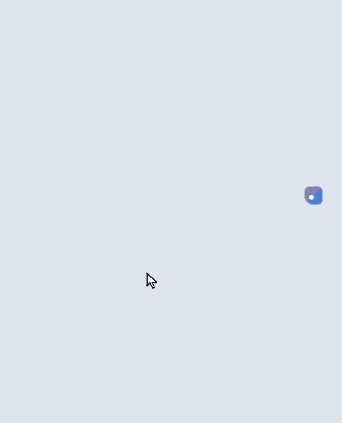
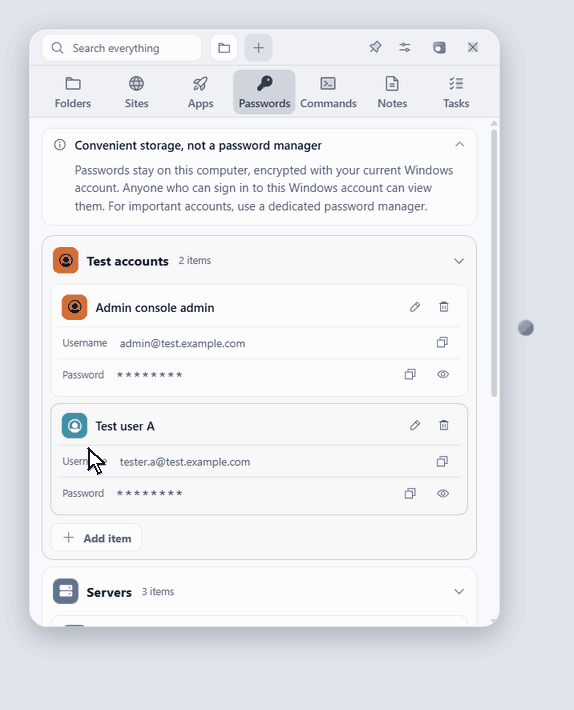
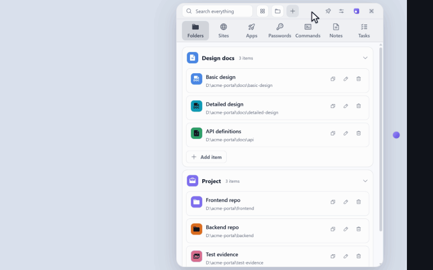
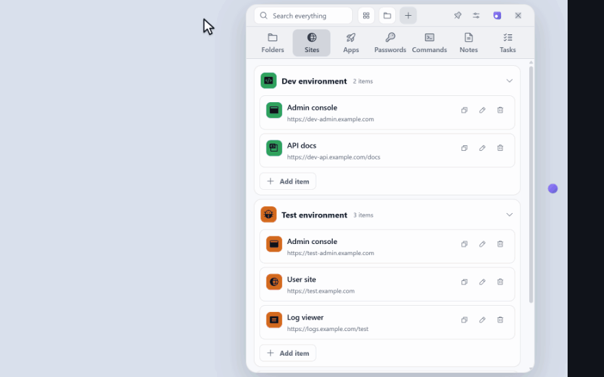
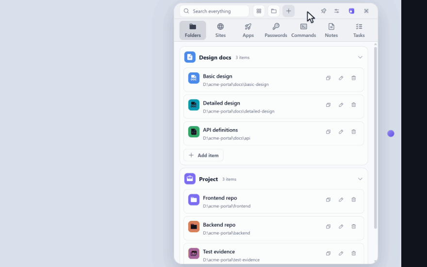

# Marubako

[English](README.md) | [简体中文](README.zh-CN.md) | [日本語](README.ja.md)

[](https://github.com/KaidoAsuka/marubako/actions/workflows/ci.yml)
[](LICENSE)

A small panel for Windows that keeps everything you open again and again at work in one place, one shortcut away.

<p align="center">
  
</p>

## Why

I made this while working as a developer. There were design documents, documents that live online, the development and test pages of every environment, and an account for each of them. Every time I needed one, I had to open some document and look it up, and switching between environments made it worse.

Now they are all in one panel, and my desktop is empty.

## What it does

**Opens anything with one click.** Folders, sites and apps, grouped by project or by environment. `Ctrl + Shift + Space` brings the panel up from any program.

**Copies accounts and commands with one click.** The user name, the password and the commands you keep typing, for every environment.

<p align="center">
  
</p>

**Finds anything.** `Ctrl + K` searches every category.

<p align="center">
  
</p>

**Switches between list and grid.** One button on the Folders, Sites and Apps pages; in the grid, each group is a tile that opens to show its items.

<p align="center">
  
</p>

**Stays out of the way.** The panel collapses into a small bubble at the edge of the screen, and the two move together.

<p align="center">
  
</p>

**Your passwords are saved only on your PC, and Marubako never sends them anywhere.** They are encrypted for your Windows account. There is no sign-up, no cloud sync and no telemetry: the only thing the app itself goes online for is its own updates from GitHub, and nothing you stored is part of that.

Also: notes and daily tasks. Light, dark and Monokai looks. English, Chinese and Japanese. The demos use made-up data.

## Install

Windows 10 or 11, 64-bit. Download `Marubako-Setup-<version>.exe` from the [latest release](https://github.com/KaidoAsuka/marubako/releases/latest) and run it.

The installer is not code-signed yet, so Windows will probably say **Windows protected your PC**: click **More info**, then **Run anyway**. It installs for your account only, without an administrator prompt, and starts Marubako. Updates arrive by themselves (**Settings > Language & data** shows the version and installs a downloaded update). To remove it, use **Settings > Apps** in Windows; your data is kept unless you say otherwise.

## Your data

Everything is in `%APPDATA%\marubako\`: one plain JSON file, with a backup for each of the last seven days. To move to another PC, use **Settings > Language & data > Export data** and **Import data** there (copying the folder does not carry the passwords, which are encrypted for one Windows account on one PC). An export with passwords holds them in plain text, and a password you copy stays on the Windows clipboard like any other copied text.

The passwords page is a convenience for accounts you want at hand, such as those of test environments. It is not a password manager: anyone who can sign in to your Windows account can read them. Keep the passwords that matter in a real one.

How the panel behaves in detail is written down in the [behavior notes](docs/behavior.zh-CN.md) (in Chinese).

## Build from source

Windows, [Node.js](https://nodejs.org/) 22.13 or newer, and Git.

```powershell
git clone https://github.com/KaidoAsuka/marubako.git
cd marubako
npm ci
npm run dev       # runs from source on %APPDATA%\marubako-dev, never on your real data
npm test          # unit tests
npm run dist      # builds the installer into release\<version>\
```

Issues and ideas are welcome in the [issue tracker](https://github.com/KaidoAsuka/marubako/issues); see [CONTRIBUTING.md](CONTRIBUTING.md) before a pull request, and [SECURITY.md](SECURITY.md) for security problems.

## License

[MIT](LICENSE). Third-party software and its licenses are listed in [THIRD-PARTY-NOTICES.md](THIRD-PARTY-NOTICES.md).
