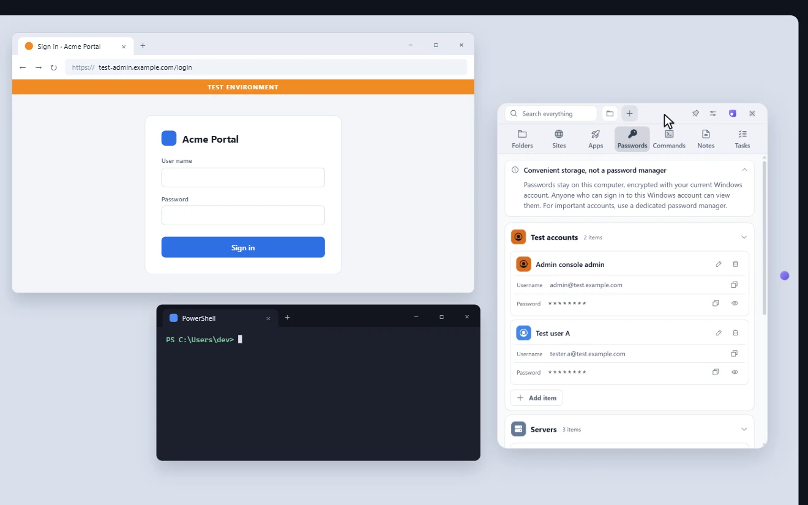
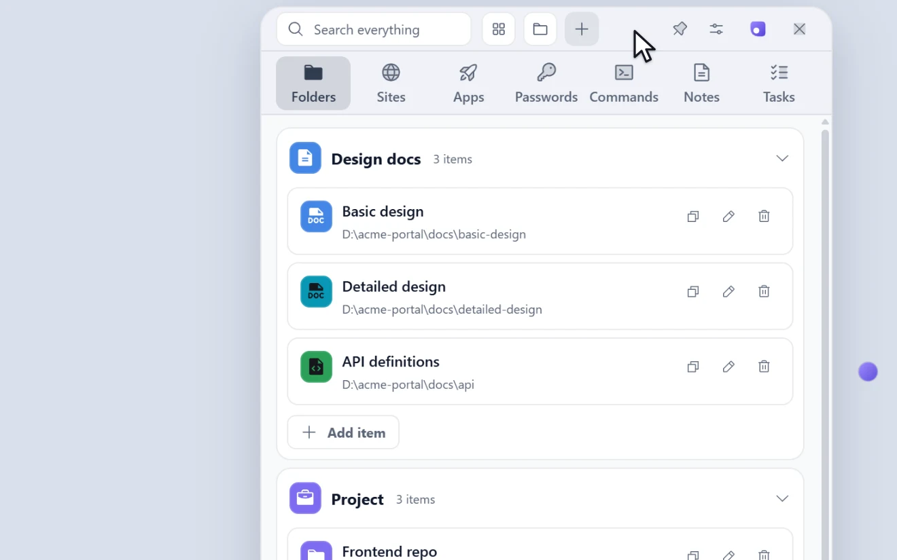
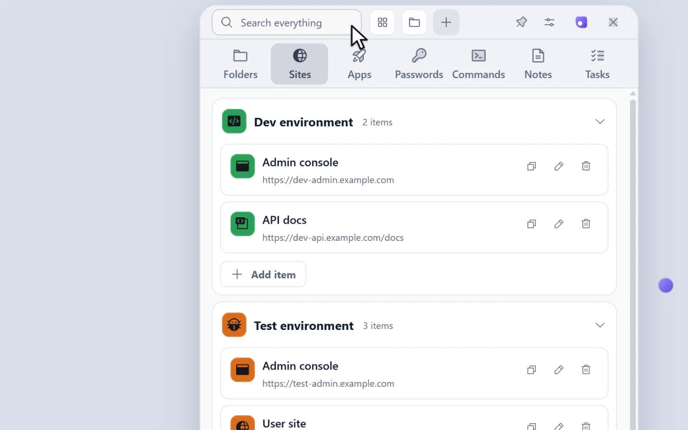

# Marubako

[English](README.md) | [简体中文](README.zh-CN.md) | [日本語](README.ja.md)

[](https://github.com/KaidoAsuka/marubako/actions/workflows/ci.yml)
[](LICENSE)

Windows 上的快速启动工具：一个小面板，把工作里要反复打开的东西收在一处，按一下快捷键就出来。

<p align="center">
  
</p>

## 为什么做这个

这是我做开发的时候想出来的。设计书、放在网上的文档、每个环境的开发和测试页面，还有它们各自的账号密码：每次要用，都得先打开某个文档去翻；在几个环境之间来回切换就更麻烦。

现在这些都在一个面板里，桌面也清空了。

## 它能做什么

**点一下就打开。** 文件夹、网站、软件，按项目或环境分组。`Ctrl + Shift + Space` 在任何程序里唤起面板。

**点一下就复制。** 每个环境的账号、密码，还有那些反复要敲的命令。

<p align="center">
  
</p>

**什么都能搜到。** `Ctrl + K` 搜索所有分类。

<p align="center">
  
</p>

**列表和网格一键切换。** 文件夹、网站、软件三页都有；网格里每个分组是一块磁贴，点开就是里面的条目。

<p align="center">
  
</p>

**不用的时候不碍事。** 面板收成屏幕边上的一个小球，球和面板一起移动。

<p align="center">
  
</p>

**密码只保存在你的电脑上，Marubako 绝不会把它们发送到任何地方。** 密码用你的 Windows 账号加密。不用注册账号，没有云同步，也不上报任何使用数据；应用自己唯一会联网做的事，是从 GitHub 检查并下载自身的更新，其中不带你存的任何内容。

另外还有备忘和每天的任务。有浅色、深色和 Monokai 配色，界面有中文、English、日本語。演示里的数据都是虚构的。

## 安装

需要 Windows 10 或 11（64 位）。在[最新发布页](https://github.com/KaidoAsuka/marubako/releases/latest)下载 `Marubako-Setup-<版本号>.exe` 并运行。

安装包还没有代码签名，Windows 很可能提示 **Windows 已保护你的电脑**：点 **更多信息**，再点 **仍要运行**。它只为你的账号安装，不需要管理员权限，装完直接启动。之后会自动更新（**设置 > 语言与数据** 里能看到版本，也能安装已下载的更新）。卸载请用 Windows 的 **设置 > 应用**；除非你选择删除，数据会保留。

**不想安装：** 改下 `Marubako-<版本号>-portable.zip`，解压到任意位置，运行文件夹里的 `Marubako.exe`。这个绿色版把所有东西都放在旁边的 `data` 文件夹里，不会自动更新：有新版本时它会提示你，你先退出 Marubako，再把新的压缩包解压到原来的位置、覆盖旧文件（你的 `data` 文件夹原样保留）。

## 你的数据

全部在 `%APPDATA%\marubako\`（绿色版在它自己的 `data` 文件夹里）：一个普通的 JSON 文件，外加最近七天每天一份备份。换电脑请用 **设置 > 语言与数据 > 导出数据**，到新电脑上再 **导入数据**（直接复制文件夹带不走密码，密码是按一台电脑上的一个 Windows 账号加密的）。带密码导出的文件里，密码是明文；复制出来的密码和其他复制的内容一样，会留在 Windows 剪贴板里。**导出为 Markdown** 把同样的数据写成一份用记事本就能看的清单，留给程序不在手边的那一天；它不能再导入回来。

「密码」页是为了随手取用，适合放测试环境这类账号。它不是密码管理器：能登录你 Windows 账号的人都能看到。重要的密码请放进专门的密码管理器。

面板各处的详细行为写在[行为说明](docs/behavior.zh-CN.md)里。

## 从源码构建

需要 Windows、[Node.js](https://nodejs.org/) 22.13 或更新版本，以及 Git。

```powershell
git clone https://github.com/KaidoAsuka/marubako.git
cd marubako
npm ci
npm run dev       # 从源码运行；使用 %APPDATA%\marubako-dev，不会碰你的真实数据
npm test          # 单元测试
npm run dist      # 把安装包和绿色版压缩包打到 release\<版本号>\
```

欢迎在[问题追踪器](https://github.com/KaidoAsuka/marubako/issues)里提问题和想法；提交 pull request 之前请先读 [CONTRIBUTING.md](CONTRIBUTING.md)（英文），安全问题请按 [SECURITY.md](SECURITY.md) 私下报告。

## 许可证

[MIT](LICENSE)。第三方软件及其许可证见 [THIRD-PARTY-NOTICES.md](THIRD-PARTY-NOTICES.md)。
