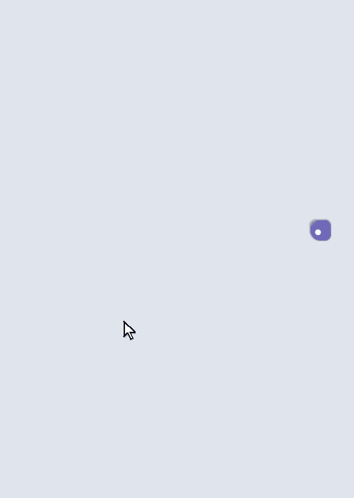
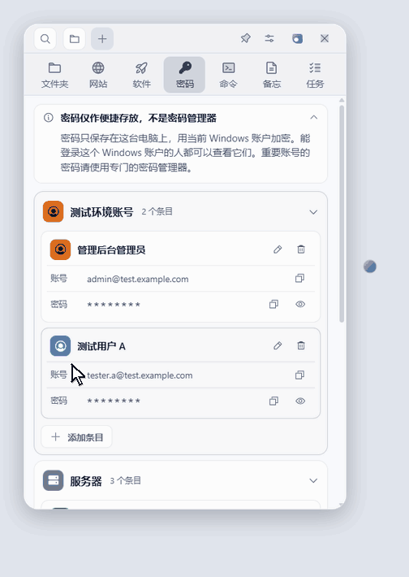
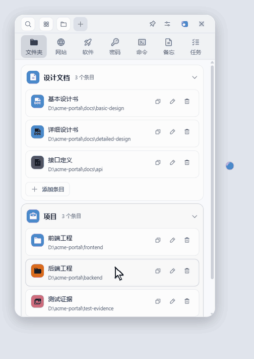
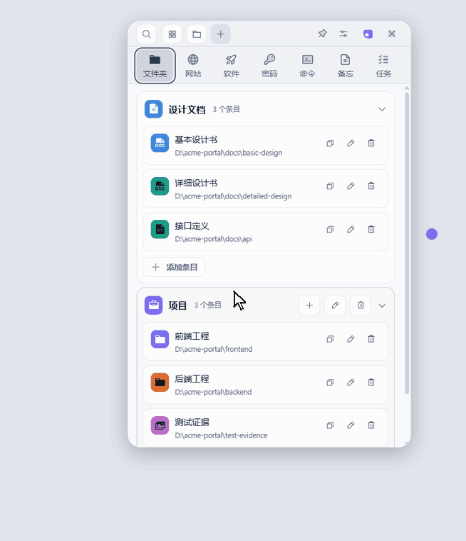
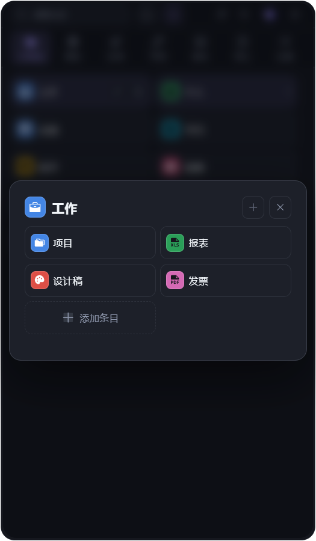
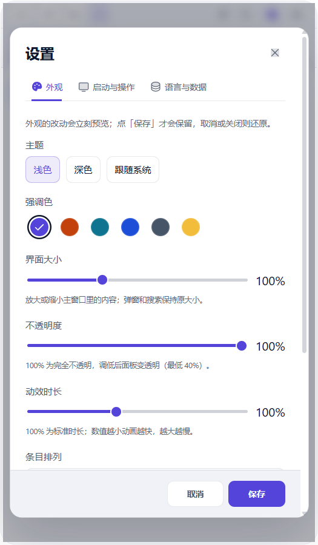

# Marubako

[English](README.md) | [简体中文](README.zh-CN.md)

[](https://github.com/KaidoAsuka/marubako/actions/workflows/ci.yml)
[](LICENSE)

Marubako 是 Windows 上的一个小面板，把工作里要反复打开的东西收在一处：文件夹和文档、各个环境的页面、账号和密码、常用命令、备忘和每天的任务。平时它是屏幕边上的一个小球，按一下快捷键就出来。

<p align="center">
  
</p>

## 为什么做这个

这个工具是我做 IT 开发的时候想出来的。

手上要管的东西太多了：各种资料和设计书，放在网上的文档，数不清的开发和测试页面，还有它们的用户名和密码；服务器的账号密码更是每个环境各有一套。以前每次要用，都得先打开某个文档去翻；在几个环境之间来回切换的时候就更麻烦。

现在这些都放在 Marubako 里，简单多了：按一下快捷键，要开的点一下就开，要填的点一下就复制。桌面也清空了：原来上面堆了一堆东西，现在都整理到这里面了。

## 它是怎么帮上忙的

下面的演示用的都是虚构的数据。

### 资料和页面，点一下就打开

按 `Ctrl + Shift + Space`，面板从任何程序里出来（见最上面的演示）。文件夹、网站、软件各占一页，可以按项目或环境分组；`Alt + 1` 到 `Alt + 7` 切换分类。要加东西也不用填表：把文件、文件夹或网址拖进面板，或者直接 `Ctrl + V` 粘贴，它会自己放到对应的分类里。

### 每个环境的账号、密码和命令，点一下就复制

<p align="center">
  
</p>

开发、测试、预发各一组，账号和密码分开复制，密码平时不显示。常用的命令（登录服务器、看日志、重启服务）也存在这里，带语法高亮；点一下只是复制，不会替你执行。

### 记不清放在哪，就搜

<p align="center">
  
</p>

`Ctrl + K` 搜索所有分类。回车打开条目或复制它的内容，`Shift + Enter` 编辑，`Alt + 1` 到 `Alt + 9` 直达某一条结果。

### 不用的时候是个小球，桌面是空的

<p align="center">
  
</p>

按 `Esc` 或点标题栏上紫色的按钮，面板收成一个始终置顶的小球。单击球临时看一眼，鼠标移开就收回去；双击球保持打开。球和面板是一对，拖哪一个，另一个都跟着走。

### 还有

- **每天的任务。** 按天记录，支持子任务，有一周的日期条和日历。
- **备忘。** 发布步骤、联系人、临时记一笔，点一下复制。
- **完全在本机。** 没有账号，没有云端。数据是电脑上的一个普通 JSON 文件，每天自动备份，可以导出和导入。唯一的网络访问是检查更新。
- **按自己的喜好调整。** 浅色和深色主题（也可以跟随系统）、六种强调色（其中一种是 Monokai 配色）、列表或磁贴两种排法、界面大小、不透明度、动效快慢。界面有中文、English、日本語三种语言，第一次启动时跟随系统语言。

<table>
  <tr>
    <td></td>
    <td></td>
  </tr>
</table>

## 下载与安装

需要 Windows 10 或 11（64 位）。

1. 打开[最新发布页](https://github.com/KaidoAsuka/marubako/releases/latest)，在 **Assets** 里下载 `Marubako-Setup-<版本号>.exe`。
2. 运行安装程序。Windows 很可能会弹出一个蓝色窗口，写着 **Windows 已保护你的电脑**。这是正常的：安装包还没有做代码签名（签名证书要花钱，而这是一个免费的业余项目），SmartScreen 会提醒所有没有签名的新程序。继续的办法：
   1. 点窗口里的 **更多信息**，会出现第二个按钮。
   2. 点 **仍要运行**。
3. 安装程序没有向导，也不会问任何问题：它只为你的 Windows 账号安装（不需要管理员权限），装到 `%LOCALAPPDATA%\Programs\Marubako`，装完直接启动。

想确认文件确实是这个仓库发布的，请只从本仓库的发布页下载，并把文件的校验值和发布页上这个文件旁边显示的 SHA-256 对一下：

```powershell
Get-FileHash .\Marubako-Setup-<版本号>.exe -Algorithm SHA256
```

**更新。** Marubako 启动后不久会到 GitHub Releases 检查新版本，之后每天一次。有新版本时会在后台下载。**设置 > 语言与数据** 里能看到当前版本，也有 **检查更新** 按钮；下载好以后点 **重启并更新** 就会立即安装。你从托盘菜单退出 Marubako 时也会自动安装（关闭窗口只会把它隐藏到托盘，而 Windows 关机或重启时不会运行安装程序）。

**卸载。** 请用 Windows 的 **设置 > 应用**。卸载程序会问你要不要同时删除数据（`%APPDATA%\marubako` 里的条目、设置和已保存的密码），默认是 **否**；更新和静默卸载一定会保留数据。

## 上手

- 新安装时每个分类里都有一个示例，换成你自己的就行：点 **+**、按 `Ctrl + N`、拖入或粘贴，都能添加条目。
- 在任何地方按 `Ctrl + Shift + Space` 打开面板。这个快捷键可以在设置里更改或关掉。
- 按 `Esc` 时，面板收成悬浮球 。标题栏的关闭按钮是把 Marubako 隐藏到系统托盘，要退出请用托盘菜单。
- 在条目上点右键打开菜单，或按 `F2` 重命名、编辑，按 `Del` 删除。删除后几秒内可以用 `Ctrl + Z` 撤销。

面板各处的详细行为写在[行为说明](docs/behavior.zh-CN.md)里。

## 数据放在哪里，怎么备份

所有数据都在 `%APPDATA%\marubako\`（把它粘贴到资源管理器的地址栏就能打开）：

| 文件或文件夹            | 内容                                                                                                  |
| ----------------------- | ----------------------------------------------------------------------------------------------------- |
| `quicklaunch-data.json` | 你的全部条目。普通 JSON，可以用记事本打开；只有密码是逐条加密的。（文件名沿用了旧名，是有意保留的。） |
| `window-state.json`     | 窗口的位置、大小和悬浮球的位置。                                                                      |
| `backups\`              | 每天一份自动备份（保留最近 7 天），以及每次导入之前的一份（保留最近 3 份）。                          |
| `logs\main.log`         | 日志。报告问题时请附上相关的几行，先删掉其中不想公开的内容。                                          |

要备份，或者换电脑，请用 **设置 > 语言与数据 > 导出数据**，到另一台电脑上再 **导入数据**。直接复制整个文件夹跨电脑是不行的：密码是绑定到一台电脑上的一个 Windows 账号加密的。数据里有密码时，导出会问你要不要带上密码；带密码的文件里密码是**明文**，请放在安全的地方。要从自动备份恢复，导入 `backups\` 里的某个文件即可。

## 关于「密码」分类

「密码」分类适合放测试环境、开发服务器这类要随手取用的账号。它只是方便取用，不是密码管理器：每条密码都用这台电脑上你的 Windows 账号加密，但没有主密码，所以任何能登录这个 Windows 账号的人都能看到它们，复制出来的密码也会留在剪贴板里，直到你复制别的内容。真正重要的密码（银行、主邮箱、恢复码）请放进专门的密码管理器。

## 从源码构建

需要 Windows、[Node.js](https://nodejs.org/) 22.13 或更新版本，以及 Git。

```powershell
git clone https://github.com/KaidoAsuka/marubako.git
cd marubako
npm ci
npm run dev       # 从源码运行；使用 %APPDATA%\marubako-dev，不会碰你的真实数据
npm test          # 单元测试
npm run dist      # 把安装包打到 release\<版本号>\
```

测试、代码风格和怎样提交 pull request，请看 [CONTRIBUTING.md](CONTRIBUTING.md)（英文）。

## 参与和反馈

欢迎在[问题追踪器](https://github.com/KaidoAsuka/marubako/issues)里提交问题和想法，请选合适的表单。提交 pull request 之前请先读 [CONTRIBUTING.md](CONTRIBUTING.md)。安全问题请按 [SECURITY.md](SECURITY.md) 私下报告，不要开公开的 issue。

## 许可证

[MIT](LICENSE)。第三方软件及其许可证见 [THIRD-PARTY-NOTICES.md](THIRD-PARTY-NOTICES.md)。
